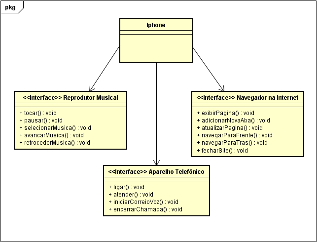

# **Orientação a Objetos e UML: Diagramação de Classes do iPhone**

Este é um diagrama UML que representa a estrutura de classe e interfaces para um sistema que inclui a modelagem do iPhone, o dispositivo incorpora as funcionalidades de: reprodutor de música, aparelho telefonico e um navegador de internet. Este diagrama foi proposto como desafio de projeto do Santander Bootcamp 2023 - Fullstack Java Backend na DIO.me.

